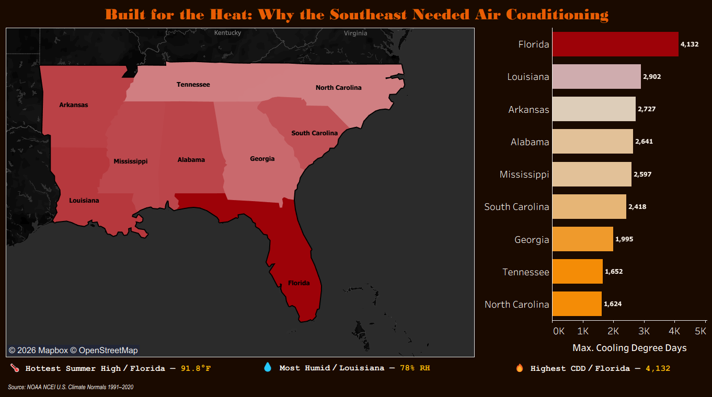
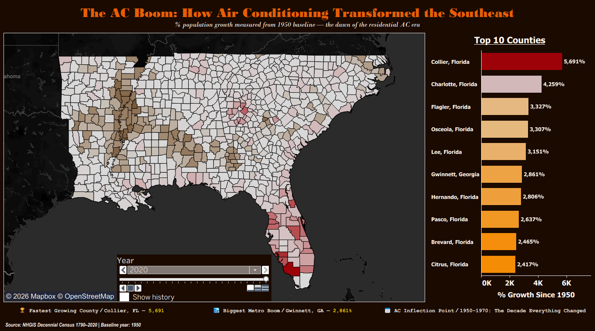
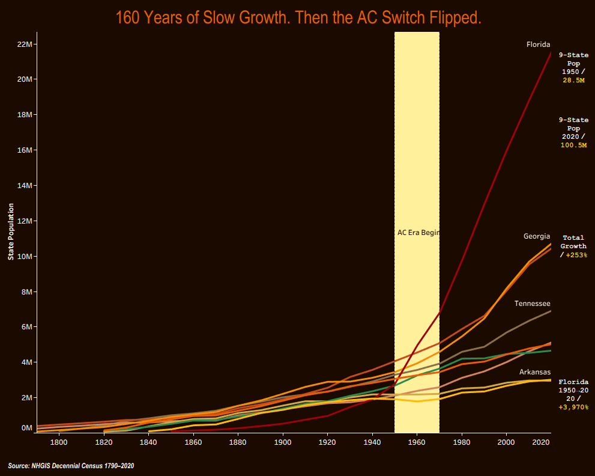

# 🌡️ Southeast AC & Population Boom

### Project 6 of 5 (Bonus) | Tools: Python, SQLite, Tableau

Every summer, headlines roll in from Europe about record heat waves and cities struggling without air conditioning infrastructure. Meanwhile, in the American Southeast, 100 million people live in some of the hottest, most humid conditions on the continent — and largely don't think twice about it. That got me thinking: how did this region go from one of the least populated parts of America to one of the fastest growing? The answer is pretty simple. We figured out how to make it livable.

This project analyzes county-level decennial Census population data from 1790 to 2020 across 9 hot-humid Southeastern states, tracing how the widespread adoption of residential air conditioning starting in the 1950s directly unlocked one of the most dramatic demographic transformations in American history.

---

## 📊 Live Dashboard

🔗 [View on Tableau Public](https://public.tableau.com/app/profile/bryce.gardner/viz/SoutheastACPopulationBoom/Story1)

---

## 🗺️ Dashboards

### Dashboard 1 — Built for the Heat
A state-level filled map colored by Cooling Degree Days (CDD), paired with a ranked bar chart, establishing the climate context for why these 9 states needed air conditioning. All 9 states are classified Hot-Humid per ASHRAE 169 climate zone definitions.



### Dashboard 2 — The AC Boom
County-level choropleth map showing % population growth since 1950 across all 755 counties in the 9-state region. Includes a Pages control to animate decade-by-decade from 1790 through 2020. Brown counties shrank relative to 1950; red counties exploded. A companion Top 10 fastest-growing counties bar chart anchors the story — Florida dominates, but Gwinnett County, GA clocks in at #6 with 2,861% growth.

> % population growth measured from 1950 baseline — the dawn of the residential AC era.



### Dashboard 3 — The Inflection
A state-level line chart spanning 1790–2020 with an AC Era reference band (1950–1970) marking exactly where the growth curves diverge. The 9-state region grew from 28.5M in 1950 to 100.5M in 2020 — a 253% increase. Florida alone went from 528K to 21.5M (+3,970%).



---

## 🔍 Key Findings

- The 9-state Southeast region grew **253%** from 1950 to 2020, from 28.5M to 100.5M residents
- **Florida** is the single most dramatic example — 528K in 1950 to 21.5M in 2020, a **3,970% increase**
- **Collier County, FL** leads all counties at **5,691% growth** since 1950
- **Gwinnett County, GA** — one of metro Atlanta's suburban engines — grew **2,861%** since 1950
- Rural counties across Mississippi, Arkansas, and Alabama show significant population loss over the same period, highlighting that AC-era growth was concentrated in metros and coastal areas
- Every state shows near-flat growth pre-1950, then a sharp inflection beginning in the 1950s–1960s — precisely when window AC units became affordable for middle-class households and central AC became standard in new construction

---

## 🗃️ Data Sources

| Source | Data | URL |
|---|---|---|
| IPUMS NHGIS | Decennial Census County Population A00, 1790–2020 | [nhgis.org](https://www.nhgis.org) |
| NOAA NCEI | U.S. Climate Normals 1991–2020 (hardcoded state-level CDD, temp, humidity) | [ncei.noaa.gov](https://www.ncei.noaa.gov/products/land-based-station/us-climate-normals) |
| U.S. Census Bureau / PublicaMundi | State boundary GeoJSON for custom polygon map | [github.com/PublicaMundi](https://github.com/PublicaMundi/MappingAPI) |

---

## 🛠️ Tools & Workflow

**Python (pandas)** → data cleaning, FIPS standardization, long-format ETL, climate data merge

**SQLite** → three-table database: `county_population`, `state_population`, `climate_classification`

**Tableau Public** → three-dashboard Tableau Story with custom polygon maps, Pages animation, reference bands

---

## 📁 File Structure

```
southeast-ac-population-boom/
├── py/
│   ├── etl_southeast_population.py       # Main ETL: NHGIS → SQLite + CSVs
│   └── etl_climate_classification.py     # Climate hardcode + merge layer
├── csv/
│   ├── county_population_climate.csv     # 14,118 rows — main Tableau source
│   ├── state_population_climate.csv      # State-level rollup with climate data
│   ├── state_polygons_climate.csv        # Custom polygon CSV for state filled map
│   └── climate_classification.csv        # 9-row climate lookup table
├── screenshots/
│   ├── southeast_ac_dashboard1_heat.png
│   ├── southeast_ac_dashboard2_boom.png
│   └── southeast_ac_dashboard3_inflection.png
├── southeast_population.db
├── Southeast AC Population Boom.twb
└── README.md
```

---

## ⚙️ Technical Notes

**Custom polygon map:** Tableau Public has a known rendering bug that prevents Louisiana and Arkansas from filling correctly on standard state filled maps. This project bypasses Tableau's geocoding entirely by generating a custom polygon CSV from a U.S. states GeoJSON source (PublicaMundi/MappingAPI), with `POLY_ID` on Detail and `POINT_ORDER` as a Dimension on Path. All 9 states render correctly.

**FIPS zero-padding:** The NHGIS source stores STATEFP and COUNTYFP as floats. Single-digit state codes (Alabama = 01, Arkansas = 05) required explicit `astype(float).astype('Int64').astype(str).str.zfill()` handling and reading back with `dtype={'FIPS': str}` to preserve leading zeros for Tableau geocoding.

**Population baseline:** All % growth figures use 1950 as the baseline year — the last Census before residential AC became widely adopted. Counties with no 1950 data (historical ghost counties) are excluded from growth calculations.

**Climate classification:** NOAA state-level climate normals are hardcoded based on published 1991–2020 averages for representative stations. All 9 states meet the ASHRAE 169 Hot-Humid classification threshold.

---

## 🔗 Related Projects

This project is a regional expansion of county-level geographic analysis. For a focused look at one of the fastest-growing counties in this dataset specifically — **Forsyth County, GA** — see:

👉 [The Forsyth Boom](https://github.com/brycegardner90/Forsyth-Boom) | [Tableau](https://public.tableau.com/app/profile/bryce.gardner/viz/ForsythBoom/TheBusinessStory)

---

## 📊 Portfolio Navigation

| # | Project | Tools |
|---|---|---|
| 1 | [Video Game Sales Analysis](https://github.com/brycegardner90/video-game-sales-analysis) | SQL, Power BI |
| 2 | [NFL Penalty Bias Analysis](https://github.com/brycegardner90/nfl-penalty-analysis) | Python, SQL, Power BI |
| 3 | [Atlanta Rising: A Century of Growth](https://github.com/brycegardner90/Atlanta-Rising-A-Century-of-Growth) | Python, SQL, Power BI |
| 4 | [Four Tiers, One Century](https://github.com/brycegardner90/restaurant-industry-analysis) | Google Sheets, SQL, Tableau |
| 5 | [The Forsyth Boom](https://github.com/brycegardner90/Forsyth-Boom) | Python, SQL, Tableau |
| ⭐ | **Southeast AC & Population Boom** | Python, SQLite, Tableau |
